```mermaid
%%{init: {'gitGraph': {'mainBranchName': 'master'}} }%%
gitGraph
  commit id: "A"
  branch master-next
  branch upstream
  branch patches
  checkout master-next
  commit id: "B"
  commit id: "C"

  checkout upstream
  commit id: "upstream-145.0.7632.0" tag: "upstream-145.0.7632.0"
  branch upstream-145.0.7632.0-applied
  checkout upstream-145.0.7632.0-applied
  commit id: "CHR-0001-7632"
  commit id: "CHR-0002-7632"
  commit id: "CHR-0003-7632"
  checkout master-next
  merge master
  checkout master
  merge master-next
  checkout master-next
  merge upstream-145.0.7632.0-applied
  commit id: "squash-upstream-145.0.7632.0-applied"
  commit id: "master-7632-a"
  commit id: "master-7632-b"
  commit id: "master-7632-c"

  checkout upstream
  commit id: "upstream-145.0.7640.0" tag: "upstream-145.0.7640.0"
  branch upstream-145.0.7640.0-applied
  checkout upstream-145.0.7640.0-applied
  commit id: "CHR-0001-7640"
  commit id: "CHR-0002-7640"
  commit id: "CHR-0003-7640"
  checkout master-next
  merge master
  checkout master
  merge master-next
  checkout master-next
  merge upstream-145.0.7640.0-applied
  commit id: "squash-upstream-145.0.7640.0-applied"
  commit id: "master-7640-a"
  commit id: "master-7640-b"
  commit id: "master-7640-c"

  checkout upstream
  commit id: "upstream-145.0.7650.0" tag: "upstream-145.0.7650.0"
  branch upstream-145.0.7650.0-applied
  checkout upstream-145.0.7650.0-applied
  commit id: "CHR-0001-7650"
  commit id: "CHR-0002-7650"
  commit id: "CHR-0003-7650"
  checkout master-next
  merge master
  checkout master
  merge master-next
  checkout master-next
  merge upstream-145.0.7650.0-applied
  commit id: "squash-upstream-145.0.7650.0-applied"
  commit id: "master-7650-a"
  commit id: "master-7650-b"
  commit id: "master-7650-c"

  checkout upstream
  commit id: "upstream-145.0.7660.0" tag: "upstream-145.0.7660.0"
  branch upstream-145.0.7660.0-applied
  checkout upstream-145.0.7660.0-applied
  commit id: "CHR-0001-7660"
  commit id: "CHR-0002-7660"
  commit id: "CHR-0003-7660"
  checkout master-next
  merge master
  checkout master
  merge master-next
  checkout master-next
  merge upstream-145.0.7660.0-applied
  commit id: "squash-upstream-145.0.7660.0-applied"
  commit id: "master-7660-a"
  commit id: "master-7660-b"
  commit id: "master-7660-c"

  checkout patches
  commit id: "patches-145.0.7632.0-applied"
  commit id: "patches-145.0.7640.0-applied"
  commit id: "patches-145.0.7650.0-applied"
  commit id: "patches-145.0.7660.0-applied"
  checkout master-next
  commit id: "D"
```

## Extension release workflow

This repository includes a manual GitHub Actions workflow at `.github/workflows/release-extension.yml`.

Workflow behavior:

- It is started with `workflow_dispatch`.
- You choose exactly one extension workspace to release.
- You choose where to publish it: `vscode-marketplace`, `open-vsx`, or `both`.
- The workflow installs dependencies, compiles the workspace, builds the Mermaid bundle for Docker Runner, packages the selected extension as a `.vsix`, uploads that package as an artifact, and then publishes it.

Release prerequisites:

- The selected extension's `package.json` must already contain the final `version` you want to publish.
- The selected extension's `package.json` must use a real `publisher` value. The workflow intentionally fails if the publisher is still `local-dev`.

Pipeline variables required for release:

- `VSCE_PAT` secret: Personal access token for publishing to the VS Code Marketplace. Required when the target is `vscode-marketplace` or `both`.
- `OPEN_VSX_TOKEN` secret: Token for publishing to Open VSX. Required when the target is `open-vsx` or `both`.

Recommended GitHub secret names:

- `VSCE_PAT`
- `OPEN_VSX_TOKEN`
