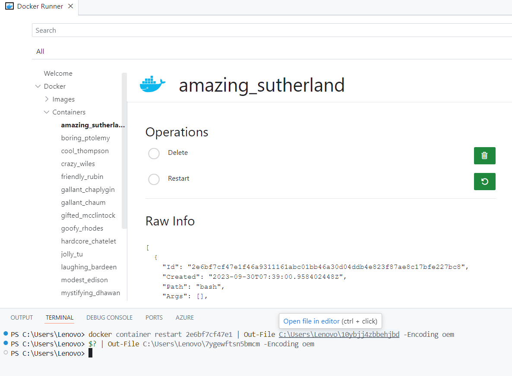

# SmarterCode Docker Runner [PREVIEW]

> **Note:** This extension is currently being restored! New features will appear in comming days!

It recently came to my attention that one of my extensions created 7 years ago is still getting around 1000 downloads every month. Unfortunately it didn't work any longer so I decided to release completely new version!



Here's a starting point!

Read more here: https://zikalino.substack.com/p/reviving-docker-runner-vscode-extension

## Mermaid customization workflow

Docker Runner uses a local Mermaid bundle for the diagram viewer.

- TypeScript source: `media-src/mermaid-custom.ts`
- Output bundle consumed by webview: `media/mermaid.min.js`

Commands:

- `npm run build:mermaid` builds a minified production bundle.
- `npm run build:mermaid:dev` builds a readable development bundle.

Examples:

```bash
npm --workspace extension-docker-runner run build:mermaid:dev
npm --workspace extension-docker-runner run build:mermaid
```
